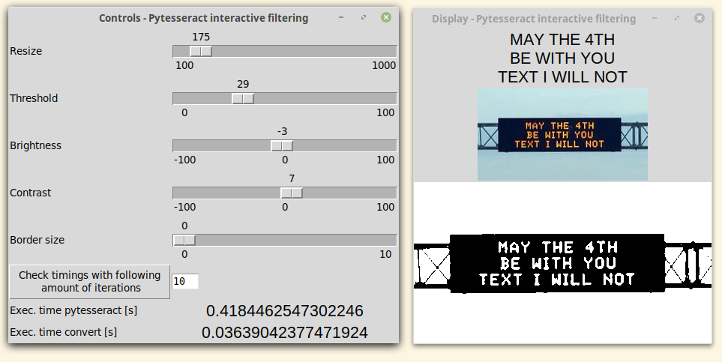

# ocr-pytesseract-interactive-image-processing
Simple GUI-based application to help you best pre-filter your image before being read by pytesseract.

To process the image, 'convert' by ImageMagick is used.

In the Display window (right):
+ First line: what pytesseract is reading from the image at the bottom.
+ Second line: original image.
+ Third line: image processed using the parameters used in window 'Controls', which is "read" by pytesseract.

In the Controls window (left) you can set the following options that affect the aforementioned 'convert' function:
+ Set '-resize' %. 100= unchanged, 1000=10 times bigger.
+ Set '-threshold' in %.
+ Set brightness in '-brightness-contrast'.
+ Set contrast in '-brightness-contrast'.
+ Set border '-border'. E.g. 3= a 3pixel by 3pixel white border. This one is hard to see in the app, but check the output file to see it better.

**Usage**: first place a file called 'test.png' in the same folder as the program, then do `python3 main.py`.

Coming soon (in order of priority/feasibility):
* save current settings/load last saved settings ✔️
* show the full 'convert' function with all used options ✔️
* add image rotation ✔️
* pick image by selecting area on screen 💪️
  * make a rectangle appear in the selected area
* short gif/video to show basic functionality
* make it more maintainable and reusable
* use pytest
* add image with drag and drop
* Add functions erode, dilate, open, close, smooth with shapes diamond, square, octagon disk, plus, cross, ring, rectangle ([check this out](https://www.imagemagick.org/Usage/morphology/))
* enter parameters through text-box (to avoid slow  slider)
* personalized slider-step
* ordering of the options. Currently the order is from top to bottom, but doing for example thresholding before resizing may influence the result.
* make it nice with ttk
* checkbox to enable/disable each slider
* integrate with trevis-ci.org, codecov.io, codeclimate.com
* test on win 👎️

Tested with/on:
- linux mint 19.1
- python 3.6.7
  - Pillow 6.0.0
  - pytesseract 0.2.6
  - pynput 1.4.2
  - TkInter 8.6
- ImageMagick 6.9.7-4 Q16
- scrot 0.8
- tesseract 4.0.0-beta.1 (leptonica-1.75.3, libgif 5.1.4 : libjpeg 8d (libjpeg-turbo 1.5.2) : libpng 1.6.34 : libtiff 4.0.9 : zlib 1.2.11 : libwebp 0.6.1 : libopenjp2 2.3.0)

Bugs:
- closing Display window doesn't close the whole program. Currently no way to make Display reappear without restarting the app.
