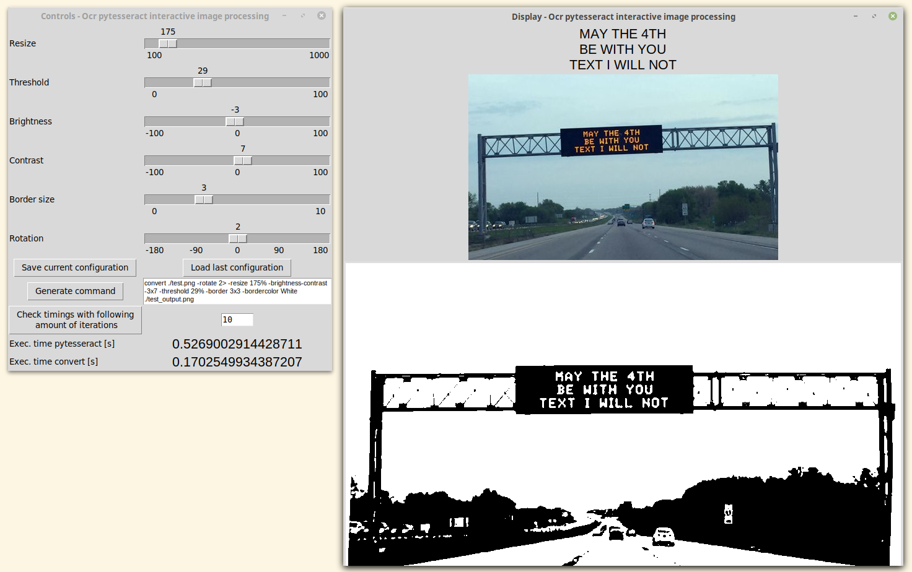

# pytesseract-interactive-filtering
Simple GUI-based script to help you best pre-filter your image before being read by pytesseract.

To process the image, 'convert' by ImageMagick is used.



+ First line: what pytesseract is reading from the second image.
+ Second line: original image.
+ Third line: processed image with the following parameters (read by pytesseract).
+ Set '-resize' %. 100= unchanged, 1000=10 times bigger.
+ Set '-threshold' in %.
+ Set brightness in '-brightness-contrast'.
+ Set contrast in '-brightness-contrast'.
+ Set border '-border'. E.g. 3= a 3pixel by 3pixel white border. This one is hard to see in the app, but check the output file to see it better.

Usage
```bash
python3 main.py
```

Suggestion: the slider that controls the size (resize) is best used when clicking on the dark area. Instead, if you slide by grabbing the slider the interface gets messy.

Tested with:
- linux mint 19.1
- python 3.6.7
- Pillow 6.0.0
- pytesseract 0.2.6
- TkInter 8.6
- ImageMagick 6.9.7-4 Q16
